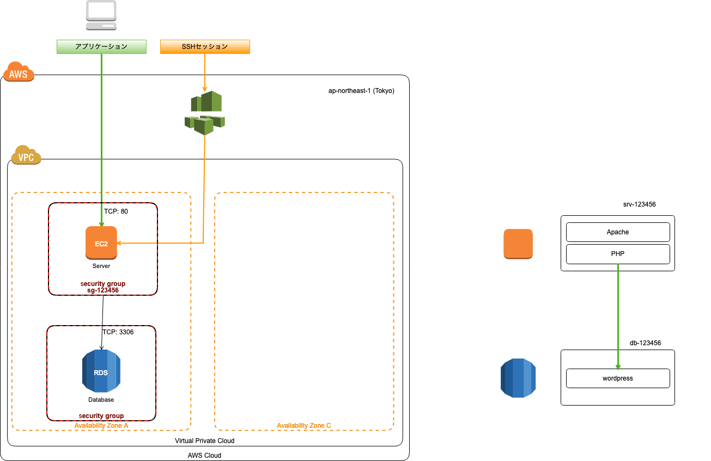
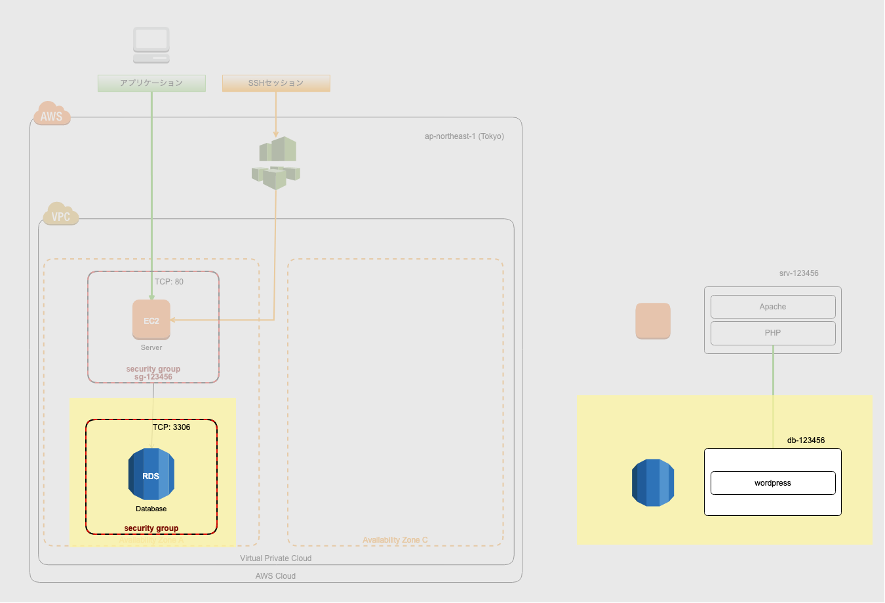
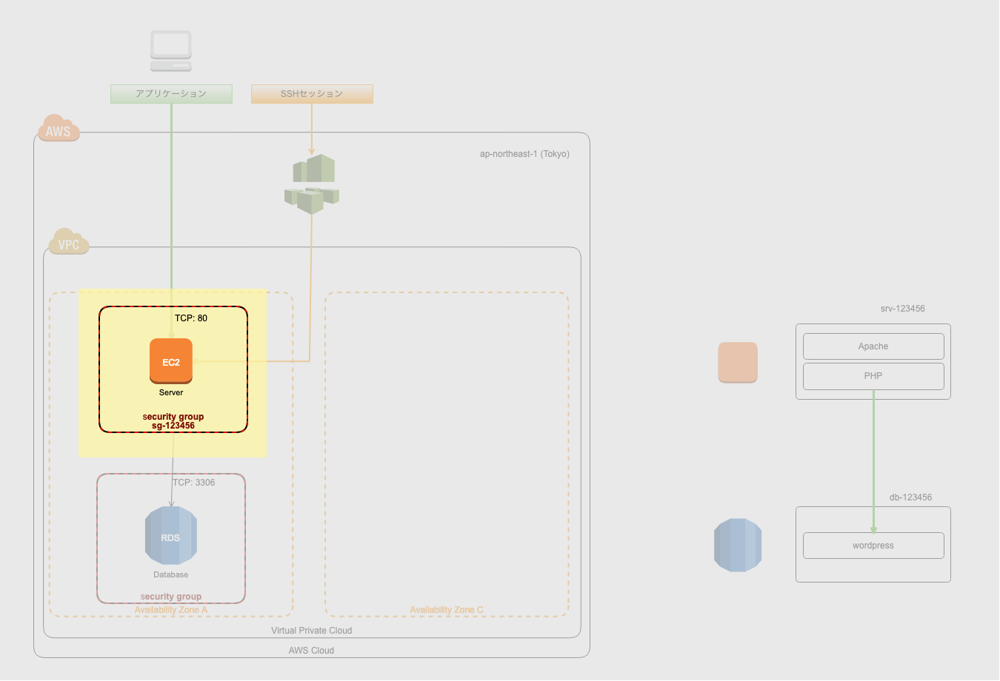
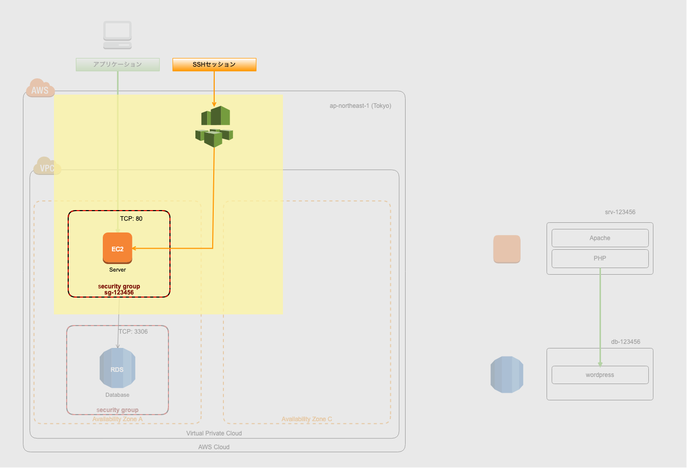
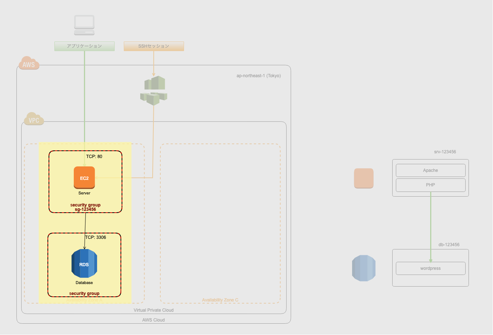
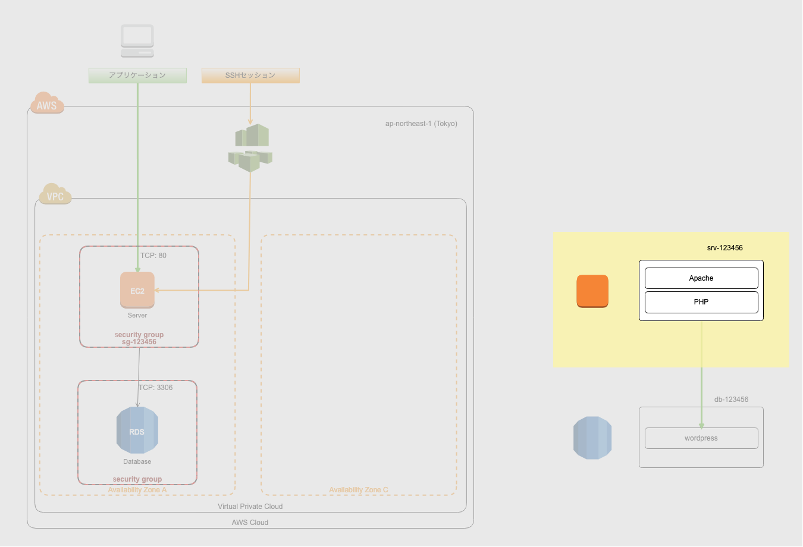
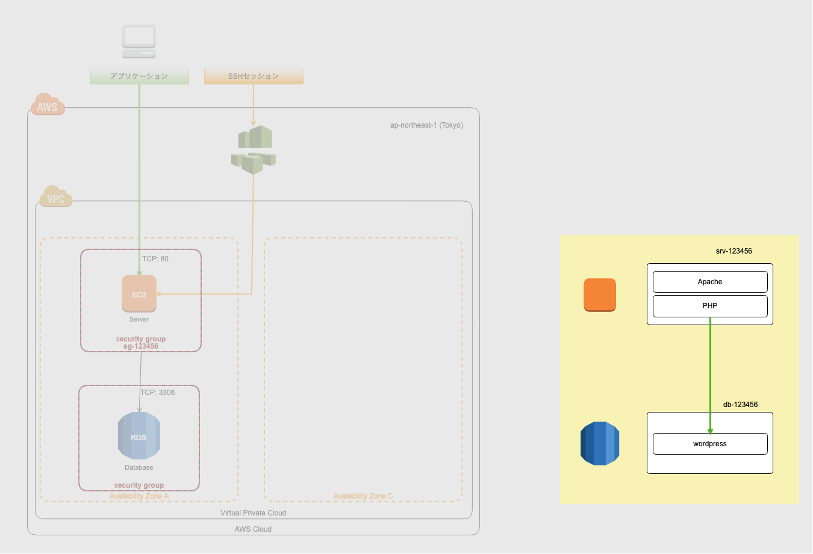

## 上越公務員・ビジネス専門学校

### AWS EC2/RDS演習
### 2019/03/15


## 最終的な構成図



## ステップ0: マネージメントコンソールの表示
- リージョンを東京にする
- サービスをクリックする


## ステップ1: RDSの起動



### 手順0:
- RDSマネージメントコンソールを開く
- データベースの作成をクリックする


### 手順1: エンジンの選択
- MySQLを選択する


### 手順2: ユースケース
- 開発/テスト - MySQL を選択する


### 手順3: DB 詳細の指定
- DBエンジンのバージョン: MySQL 5.6.40
- DBインスタンスのクラス: db.t2.micro
- ストレージ割り当て: 20GiB
- DBインスタンス識別子: db-(自分のIAMユーザー名)
- マスターユーザの名前: admin
- マスターパスワード: pw-(自分のIAMユーザー名)


### 手順4: [詳細設定] の設定
#### ネットワーク & セキュリティ
- VPC: デフォルト
- サブネットグループ: default
- パブリックアクセシビリティ: いいえ
- アベイラビリティーゾーン: ap-northeast-1a
- VPCセキュリティグループ: 新規のVPCセキュリティグループを作成


#### データベースの設定
- データベースの名前: wordpress
- ポート、DBパラメータグループ、オプショングループ: 初期設定のそのまま
- IAM DB 認証: 無効化 (そのまま)


#### 暗号化
- さわらない（さわれない）

#### バックアップ
- 初期設定のまま


#### モニタリング
- 拡張モニタリングを無効にする (そのまま)

#### ログのエクスポート
- 初期設定のまま

#### メンテナンス
- 初期設定のまま

#### 削除保護
- 削除保護の有効化: チェックを外す


#### DB作成の実行
- データベースの作成をクリックする
- DBインスタンスの詳細の表示をクリックする


## ステップ2: EC2の起動



### 手順0: 作業開始
- EC2マネージメントコンソールを開く
- インスタンスの作成をクリックする


### 手順1: マシンイメージ
- Amazon Linux 2 AMI (HVM), SSD Volume Type


### 手順2: インスタンスタイプ
- t2.micro


### 手順3: インスタンス詳細
- ネットワーク: default
- サブネット: ap-northeast-1a
- 自動割り当てパブリックIP: 有効
- IAM Role: EC2SSMRole


### 手順4: ストレージの追加
- そのまま


### 手順5: タグの追加
- キー: Name
- 値: (自分のIAMユーザー名)


### 手順6: セキュリティグループの設定
- 新しいセキュリティグループを作成する
- セキュリティグループ名: (自分のIAMユーザー名)-sg
- 説明: グループ名と同じ
- タイプ: HTTP
- プロトコル: TCP (そのまま)
- ポート範囲: 80 (そのまま)
- ソース: プルダウンメニューからマイIPを選択する
- 説明: 空


### 手順7: インスタンス作成の確認
- 上記を確認する


### 手順8: キーペアを選択
- キーペアなしで続行


### インスタンス作成完了
- *インスタンスの表示* をクリックする


## ステップ3: インスタンスに接続する



### 手順1: Systems Manager コンソールを開く
- サービス → SSM → 右クリック → リンクを新しいタブで開く
- 自分のインスタンスを選択しセッションの開始


## ステップ4: DBにEC2からアクセス可能にする



### 手順1: RDSマネージメントコンソールを開く
- 自分のインスタンスを選択
- VPCセキュリティグループをクリックする


### 手順2: EC2からの接続を許可する
- インバウンドタブを選択する
- 編集をクリックする
- ルールの追加をクリックする
  - タイプ: MySQL/Aurora
  - プロトコル: TCP (そのまま)
  - ポート範囲: 3306 (そのまま)
  - ソース: カスタム
    - EC2作成時に作成した (自分のIAMユーザー名)-sg を指定する
    - 選択すると自動的にセキュリティグループIDに変換される
- 保存する


## ステップ５: Wordpressをインストールする



### 手順1: ApacheとPHPのインストール
- 下記コマンドをコピペして実行する
```
sudo amazon-linux-extras install -y php7.2
sudo yum install -y httpd
sudo systemctl start httpd
sudo systemctl enable httpd
```


### 手順2: Webに接続してみる
 - EC2マネージメントコンソールで自分のインスタンスの *IPv4 パブリック IP* を確認する
 - ブラウザでアクセスして表示されればOK


### 手順3: Wordpressをインストールする
- 下記コマンドをコピペして実行する
```
# ホームディレクトリに移動する
cd
wget https://wordpress.org/latest.tar.gz
sudo tar xvzf latest.tar.gz -C /var/www --transform 's/^wordpress/html/g'
sudo chown -R apache:apache /var/www/html
```


### 手順4: 再度Webに接続してみる
- 手順2のIPアドレスに再度アクセスしWordpressの画面がでてきたらOK


## ステップ6: Wordpressを設定する



### 手順0: RDS(DB)のホスト名を確認する
- RDSマネージメントコンソールを開く
- 自分の作成したデータベースを選択する
- *エンドポイント* にあるホスト名を確認しておく


### 手順1: 言語選択
- 日本語を選択する


### 手順2: データベース接続情報
- データベース名: wordpress
- ユーザー名: admin
- パスワード: pw-(自分のIAMユーザー名)
- データベースのホスト名: 先程エンドポイントで確認したホスト名をコピペする
- テーブル接頭辞: wp_ (そのまま)


### 手順3: インストール実行
- 問題なければ*インストール実行*ボタンが表示される
- もしエラーがでていたらDB名、ホスト名、パスワード等を確認する


### 手順4: サイト情報の入力
- サイトのタイトル: (あなたの名前)のブログ
- ユーザー名: 例 ueki.kazuki
- パスワード: 表示されているパスワードをメモ帳にコピーする
- メールアドレス: メールアドレスを入力する
- 検索エンジンでの表示: チェックしない (そのまま)
- Wordpressをインストールボタンをクリックする


### 手順5: インストール成功
- *成功しました!*と表示されれば成功


### 手順6: Wordpressにログインする
- ログインボタンをクリックし先程のユーザー名とパスワードでログインできればOK


## Extra: 考えてみよう
- HTTPだとパスワードが平文で流れます、どうやって暗号化しますか？
- もしAZ障害が起きたらどうしますか？
- もしリージョン障害が起きたらどうしますか？
- データベースのバックアップはどうしますか？
- データベースのバージョンアップはどうしますか？
- Wordpressのバージョンアップはどうしますか？
